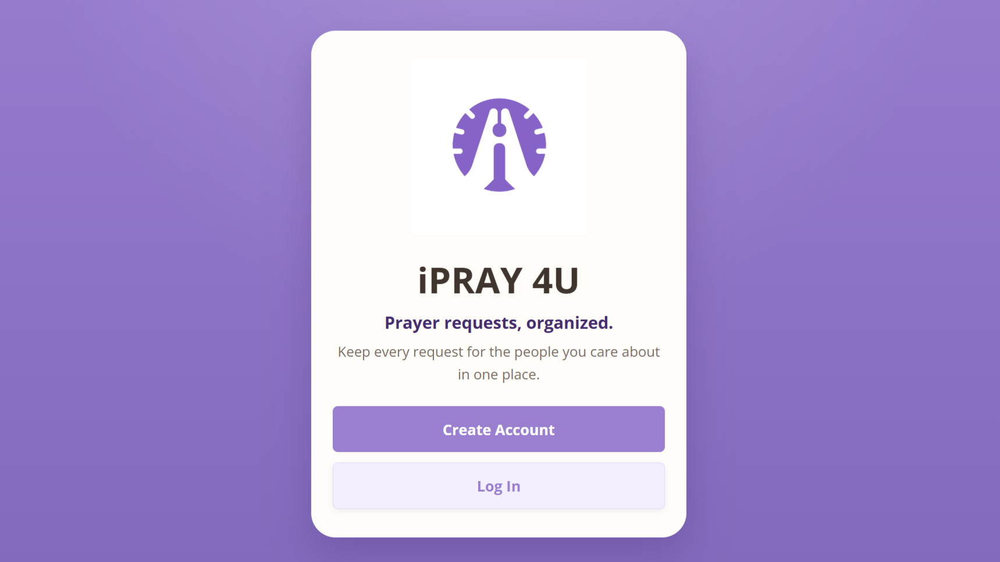
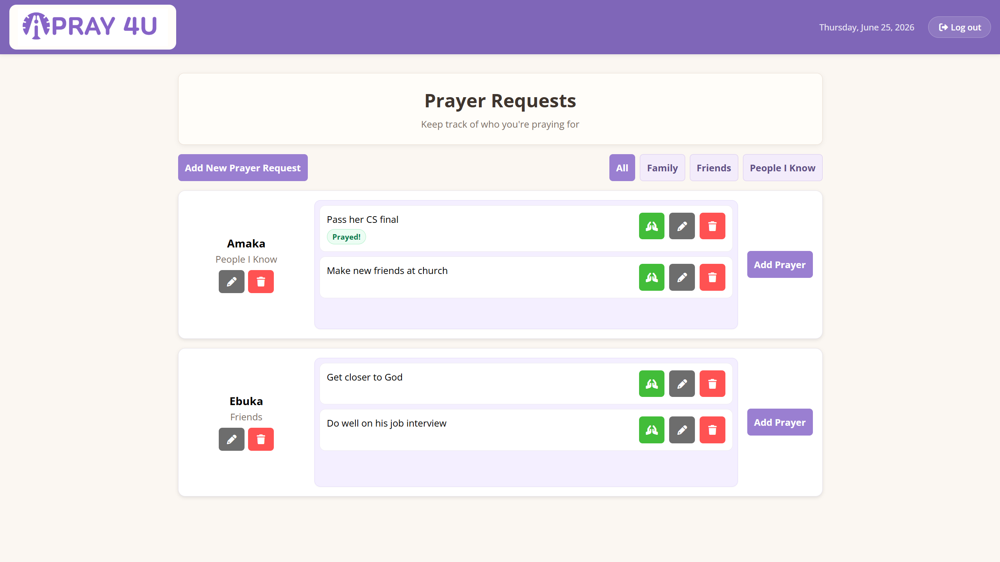

# iPRAY 4U

**Prayer requests, organized.**

🌐 **Try iPRAY 4U:** [ipray4u.app](https://ipray4u.app)

## About
*"Can you pray for me?"*

**iPRAY 4U** helps you keep track of the prayer requests shared by the people in your life. Instead of keeping requests scattered across your Notes app, text messages, or memory, iPRAY 4U keeps every request for the people you care about in one place.

Organize prayer requests by person, group people by relationship, and stay intentional about praying for family, friends, and more. iPRAY 4U was built to make it easier to faithfully remember and follow through on the prayer requests entrusted to you.

## Features
- Organize prayer requests by person and relationship
- Manage people and their prayer requests
- Track which prayer requests you've already prayed for
- Access your prayer requests from your own secure account

## Screenshots

<p align="center">
  
</p>

<p align="center">
  
</p>

## Tech Stack

**Frontend:** HTML, CSS, JavaScript

**Backend:** Python, Flask

**Database:** PostgreSQL

**Authentication:** Supabase Auth

**Deployment:** Render

**Testing & CI/CD:** pytest, GitHub Actions

## Prerequisites
* Python 3.12
* Recommended: virtual environment

## Installation

### Clone the repository

```bash
git clone <repository-url>

cd <project-folder>
```

### Create and activate virtual environment

```bash
python -m venv venv
```

Windows:

```bash
venv\Scripts\activate
```

macOS/Linux:

```bash
source venv/bin/activate
```

### Install dependencies

```bash
pip install -r requirements.txt
```

## Environment Variables
Copy `.env.example` to `.env`, then replace its placeholders with values for your environment:

```bash
cp .env.example .env
```

The application validates its required environment variables at startup. `APP_BASE_URL` must be the public base URL for the current environment.

```env
# Local development
APP_BASE_URL=http://localhost:5000

# Example production URL
# APP_BASE_URL=https://your-app.example.com

# Deployed environments only: staging or production.
# Leave unset locally. When APP_ENV is unset, the app defaults to
# local-development behavior (for example, allowing the in-memory rate-limit backend).
# APP_ENV=production

DATABASE_URL=
TEST_DATABASE_URL=
SECRET_KEY=
SUPABASE_URL=
SUPABASE_PUBLISHABLE_KEY=

# Local/test default. Staging and production must use a shared Redis/Valkey
# backend on Render.
RATELIMIT_STORAGE_URI=memory://

# Local development over HTTP
SESSION_COOKIE_SECURE=False

# Production over HTTPS
# SESSION_COOKIE_SECURE=True
```

Staging and production must use a shared limiter backend, such as Redis/Valkey.
Do not use `memory://` outside local development and tests. The app trusts one
Render proxy hop by default so Flask-Limiter keys requests by the real client IP
from `X-Forwarded-For`.

### Supabase Password-Recovery Template

Add `<APP_BASE_URL>/reset-password` to the allowed redirect URLs in Supabase Auth. Then update the **Reset Password** email template under **Authentication → Email Templates** so its link sends the recovery token hash to the Flask app:

```html
<a href="{{ .RedirectTo }}?token_hash={{ .TokenHash }}&amp;type=recovery">
  Reset password
</a>
```

The app verifies this one-time token on form submission with Supabase Python's public `verify_otp({"token_hash": ..., "type": "recovery"})` API. This server-rendered flow does not depend on URL fragments or browser-side authentication JavaScript.

## Run Locally
Start the Flask development server:

```bash
flask run
```

If Flask does not detect the app automatically, run:

```bash
flask --app wsgi run
```

The production deployment uses:

```bash
gunicorn wsgi:app
```

## Testing
Run the test suite:

```bash
pytest tests
```
